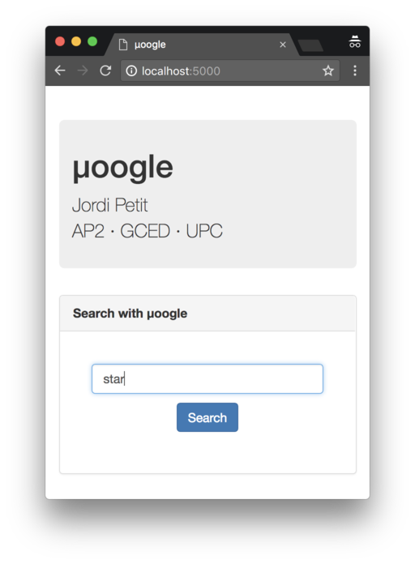
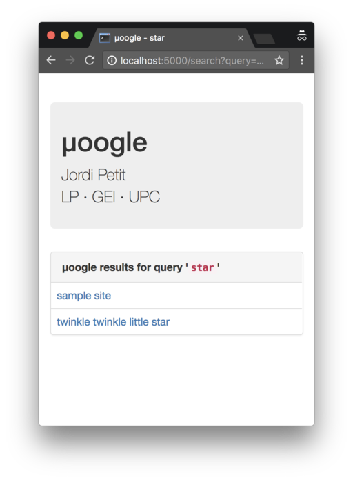
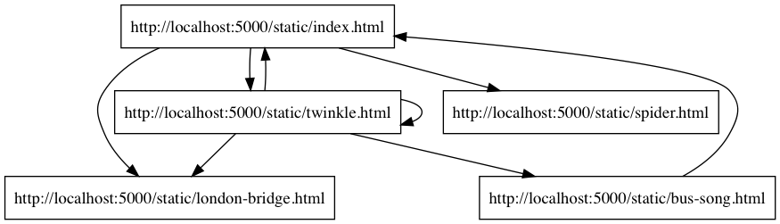

# µoogle

The µoogle project for GEI-LP (2018 edition)


# Documentation

This page describes the µoogle project for the LP course at GEI. µoogle stands for
"micro Google" and your task is to implement the core of a simple system to
crawl web pages and answer queries from users, by reporting which crawled pages
fulfill their queries.


## Demo

This screenshot shows the home page of the web server:



Looks familiar?

This screenshot shows the results of quering for `star`:




## Queries

There are two kinds of queries:

- Simple queries only contain a word. The answer should include all crawled pages
  that contain the given word.

- Complex queries can express conjunctions and disjunctions. Conjunctions
  are written with `[]` expressions and disjunctions with `()` expressions.
  In these expressions, words are written in single quotes (this makes it easier
  for you!). For instance:

  - `['potatoes', 'liver', 'bacon']` is a query that should return all pages
  that contain these three words (each of them should appear in the page).

  - `('orange', 'lemon')` is a query that should return all pages
  that contain at least one of these two words (one of them them should appear in the page).

  Expressions can be arbitrarely nested. For instance:

  - `['potato', ('lemon', 'orange')]` should return all pages that contain
  the word `potato` and, either the word `lemon` or the word `orange`.

Invalid queries must return an empty list of pages.


## Architecture

The architecture of the system is as follows:

-   The `server.py` module is the web server that users will use
    in order to get answers to their queries.

    In order to start the web server, simply run `./server.py`.
    Or use the `--help` flag to get more options.

    You can interact with
    the web server by opening the `http://localhost:5000` URL in your
    browser.

    Additionally, the web server also offers some sample files
    under the `static` directory. Point your browser to
    `http://localhost:5000/static/index.html` to browse their root.
    This figure shows the relations between these
    pages:

    

    The `server.py` module is already implemented, **do not modify it**.

-   The `answer.py` module is a command line interface tool that
    developpers can use in order to get answers to their queries.
    For instance, `./answer.py -q star` will deliver the indexed web
    pages that match the query:

    ```text
    [  ('sample site', 'http://localhost:5000/static/index.html'),
       ('twinkle twinkle little star', 'http://localhost:5000/static/twinkle.html)
    ]
    ```

    For complex queries,
    double quote the query argument: `./answer.py -q "['potato', ('lemon', 'orange')]"`.

    Use `./answer.py --help` to get more options.

    This module is already implemented, **do not modify it**.

-   The `crawler.py` module is the command line interface tool that
    is used to crawl the web and index its pages. In order to
    execute it, use a command such as `./crawler.py --url http://localhost:5000/static/index.html --maxdist 4`,
    which specifies a starting page and a maximum crawling distance.
    Use `./crawler.py --help` to get more options.

    This module is already implemented, **do not modify it**.

-   The `util.py` module contains several utility functions that are used
    in the other modules.

    This module is already implemented, **do not modify it**.

-   Finally, the `moogle.py` module contains the core of the application
    and is used by `server.py`, `answer.py` and `crawler.py`, which are
    simple wrappers arround it.
    **This is the only module you have to modify.**


## System overview

The system works in two phases:

1.  In the first phase, the crawler visits some web pages and saves some
    information about them. This information is a Python object referred as the
    _database_ and is referred as `db` all through the project.
    By default, the
    database is saved in the `moogle.dat` file, but this file can be changed using
    the `--database` flag of the`server.py`, `answer.py` and `crawler.py`
    modules.


2.  In the second phase, the web server loads the database and
    processes queries from users. Alternatively, the queries can
    be processed by the `answer.py` module, which is more useful in order to
    debug.


## Your task

Your task is to implement the `moogle.py` module, so that all the project will
work as expected. In order to do so, you may modify this module at will, but
you have to implement a few functions with a given interface that is described
below. The `moogle.py` module has three parts:


### Common part

This part is meant to define all the types and functions you need.

It also must define an `authors()` function that returns a string with your
name. This information is displayed in the home page of your web server and
makes the project look very cool.


### Crawler part

This part is meant to define all the types and functions you need in order to
perform the crawling phase.

It must define a function `crawler(url, maxdist)` that crawls the web starting
from `url` and visiting all availables pages that are not further thank
`maxdist` links  from the initial page.  This function must return a database
(it is up to you to define the type and value of this database).

This part already defines a `store(db, filename)` function that
writes a database `db` in file `filename` using `pickle`.


### Answer part

This part is meant to define all the types and functions you need in order to
perform the answer phase.

You should implement the `answer(db, query)` function, that, given a database
and a query (that is, a string of cleaned words), returns a list of pages for
the given query. In this list, each page is a tuple with two fields:

- the first field is the title of the page
- the second field is the URL of the page

The `answer.py` module just prettifies this result and outputs it.

This part already defines a `load(filename)` function that
reads a database stored in file `filename` using `pickle` and returns it.

### In short:

You have to:

- Implement the `authors()` function (that's easy!!!)
- Decide which data structure will represent your database
- Implement the `crawler()` function
- Implement the `answer()` function

In order to do this, you possibly want to define types, auxiliary functions...


## The utility module

The `util.py` module contains two functions that will help you treating
words in web pages.

The `clean_word` function returns (in lowercase) the longest prefix of a word
made of latin unicode characters. This function gives the opportunity to
"normalize" words with latin letters. Here are some examples:

```python
clean_word("Jordi") -> "jordi"
clean_word("Jordi!") -> "jordi"
clean_word("LlorençGabarróNúñezÅrmstrong<>lala") -> "llorençgabarrónúñezårmstrong"
clean_word("AlfaBetaAlefChinaαßℵ中xyz") -> "alfabetaalefchina"
```

The `clean_words` function works all the same, but applied to a string
that can have many words. Here are some examples:


```python
clean_words("Jordi") -> "jordi"
clean_words("Jordi Jordi!    Llorenç#Martí") -> "jordi jordi llorenç"
```


# Usefull information

The following code snippet reads a page through its URL and prints its title,
text and all its links. Error handling has been ommitted.

```python
import urllib.request
from bs4 import BeautifulSoup

url = "http://localhost:5000/static/index.html"
response = urllib.request.urlopen(url)
page = response.read()
soup = BeautifulSoup(page, "html.parser")
print(soup.title.text)
print(soup.get_text())
for link in soup.find_all("a"):
    print(link.get("href"), link.text)
```

The following code snippet show how to save some data
(whatever its type) into a file
so that it can be retrieved latter:

```python
import pickle

data = {1:2, 2:3}
f = open("somefile.dat", "wb")
pickle.dump(data, f)
f.close()
```

And this code shows how to retrieve it back:

```python
import pickle

f = open("somefile.dat", "rb")
data = pickle.load(f)
f.close()
```

You can consider using `urllib.parse.urljoin` to combine absolute and
relative URLs. Here are some examples:

```python
>>> import urllib.parse
>>> urllib.parse.urljoin("https://jutge.org/problems", "P12345.html")
'https://jutge.org/P12345.html'
>>> urllib.parse.urljoin("https://jutge.org/problems/", "P12345.html")
'https://jutge.org/problems/P12345.html'
>>> urllib.parse.urljoin("https://jutge.org/problems", "../dashboard.html")
'https://jutge.org/dashboard.html'
>>> urllib.parse.urljoin("https://jutge.org/problems", "https://google.cat/index.html")
'https://google.cat/index.html'
```

You can consider using `ast.literal_eval` to convert the complex string
queries to Python objects. Please do not use `eval` for this, unless
you want any user delete all your files from the Internet.
Here is an example:

```python
>>> import ast
>>> ast.literal_eval("['potato', ('lemon', 'orange')]")
['potato', ('lemon', 'orange')]
```


# Install dependencies

In order to install the Python libraries you need, please run this command:

```
pip3 install -r requirements.txt
```


# Instruccions


## Lliurament

Heu de lliurar la vostra pràctica per correu electrònic al Racó.
Només heu de lliurar el fitxer `moogle.py`. Res més. Sense comprimir.
Només el fitxer `moogle.py`, amb tota la documentació pertinent dins seu.

L'ús de tabuladors en el codi queda
prohibit.
A més, es valorarà que el vostre fitxer `moogle.py` segueixi
[les regles d'estíl PEP8](https://www.python.org/dev/peps/pep-0008/). Podeu
utilitzar el paquet `pep8` o http://pep8online.com/ per assegurar-vos
que seguiu aquestes regles d'estíl.

El termini de lliurament és el 25 de juny a les 23:59:59 CET.


## Consells

- Se suposa que la fase 1 es fa de forma relativament infrequent. En canvi, se suposa 
que a la fase 2, hi ha molts usuaris fent moltes cerques. Per tant, cal optimitzar
la velocitat de resposta de les cerques.

- Segurament no us cal definir classes pròpies. Amb
tuples, llistes, diccionaris i conjunts n'hauríeu de tenir prou.

- Haureu de preveure un tractament mínim d'errors amb `try ... except`.

- Només cal que exploreu pàgines HTML.

- Si voleu fer servir algun mòdul "exòtic", consulteu-ho abans amb els
vostres professors.

